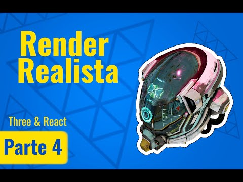

# Plantilla para usar Three.js con React 
Sientete libre de usar esta plantilla c: 
 
Plantilla para un render realista
https://www.youtube.com/watch?v=F7ZIsUJjC_8

## Instalacion 
No te olvides de ejecutar el comando $ npm install , una vez hayas descargado el proyecto c: 

## Preview

PD: Los modelos no son de mi autoria 
